<p align="center">
  
</p>

<h1 align="center">mova</h1>
<p align="center"><strong>Everything for what you're working on.</strong></p>
<p align="center">A calm, project-based workspace for tasks, notes, files, calendar, code and focus.<br/>Desktop app built with Tauri 2, React and TypeScript.</p>

---

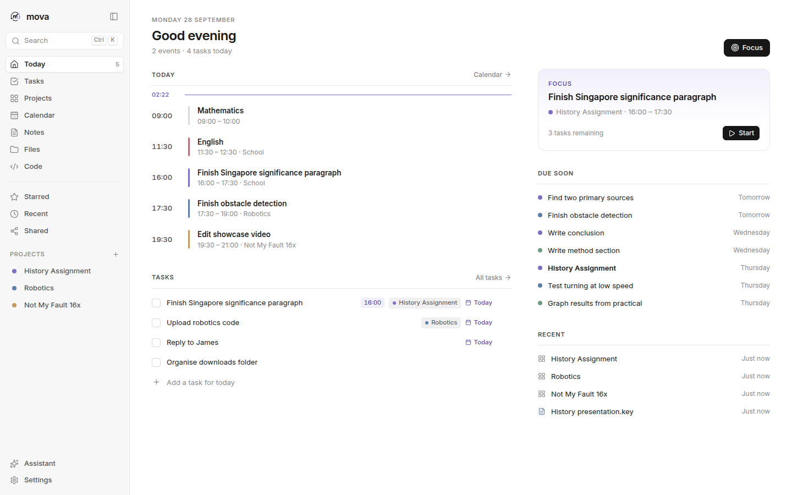

## Why mova

Your work shouldn't be scattered across ten apps. mova is organised around **projects**. Open one and its tasks, notes, files, deadlines, links and code are all there, and the **Today** screen answers one question: *what am I actually doing today?*

- **Project-first.** Everything belongs somewhere, and everything is searchable everywhere.
- **Dense when you need information, empty when you need focus.**
- **No productivity theatre.** There are few settings and few decisions, so you spend less time managing and more time doing.
- **AI that stays small.** It suggests next steps and never does the work for you.

## Screenshots

| Projects | Project workspace |
|---|---|
| 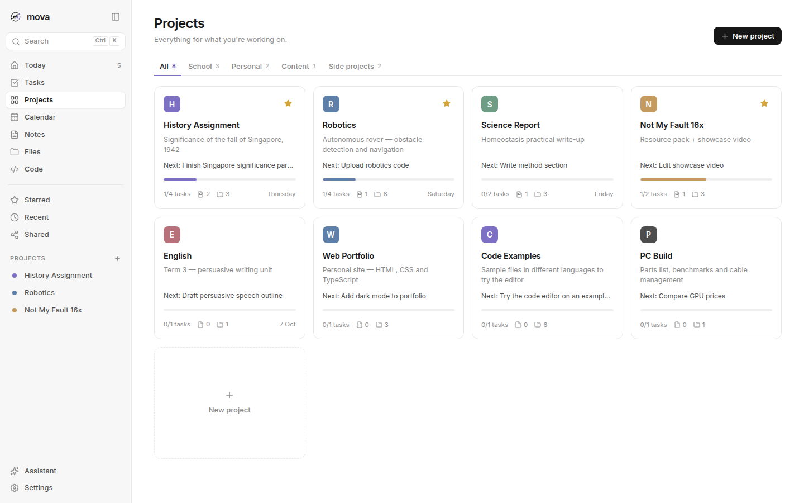 | 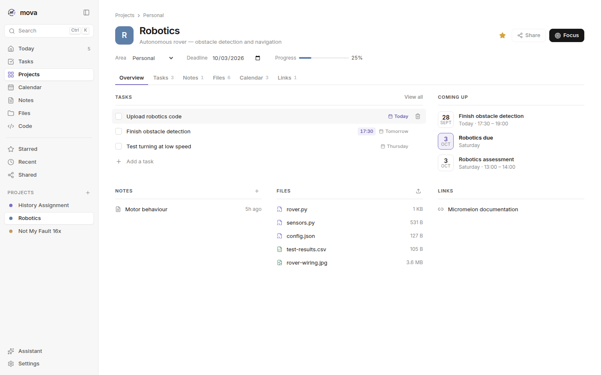 |
| **Tasks** | **Calendar** — drag tasks onto time |
| 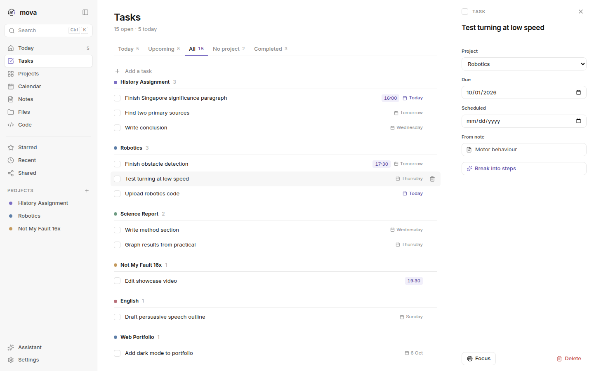 | 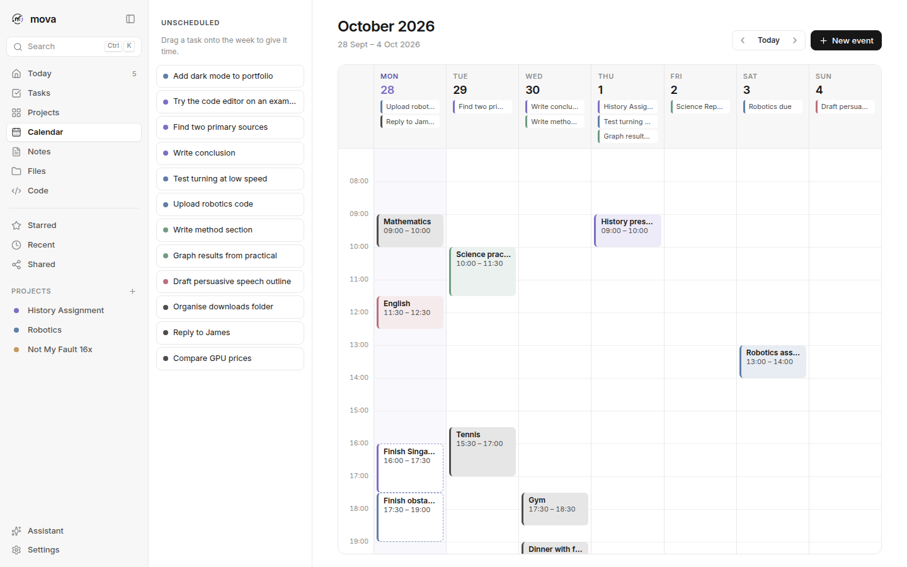 |
| **Notes** — turn lines into tasks | **Files** |
| 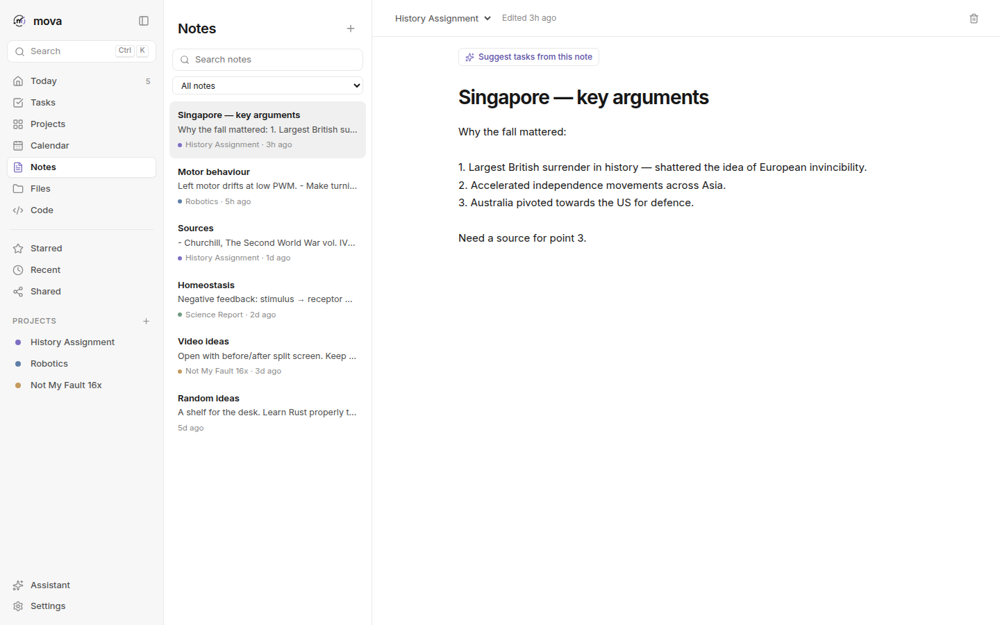 | 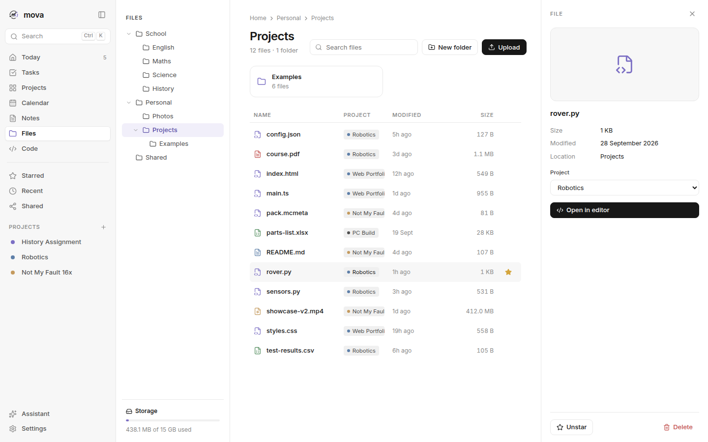 |
| **Code** — Monaco / Code - OSS editor | **Search** — `Ctrl/⌘ K` |
| 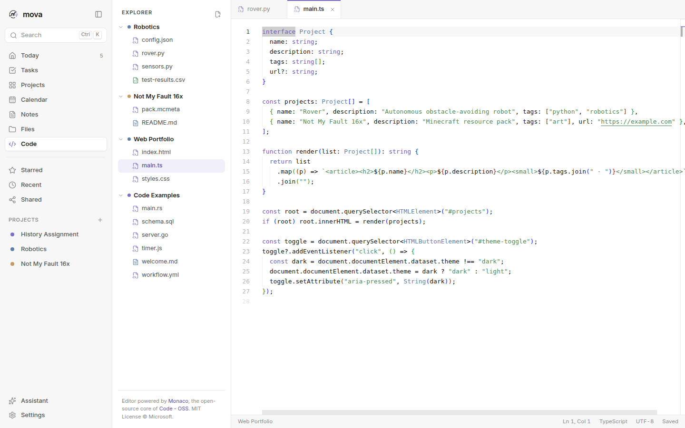 | 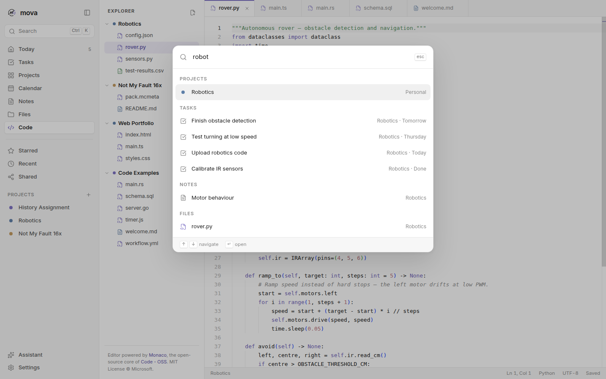 |
| **Focus mode** | **Assistant** |
| 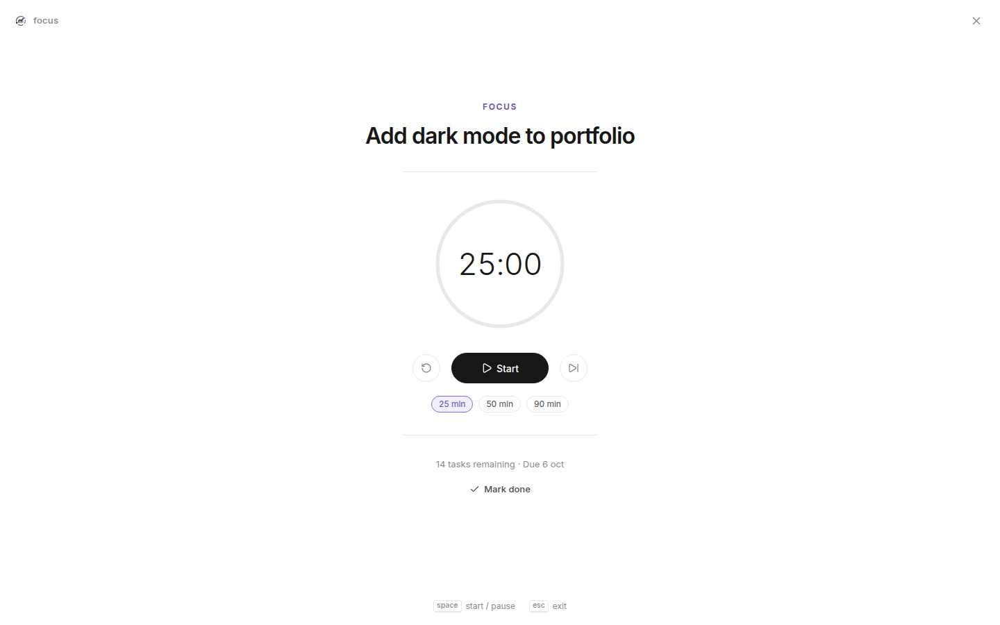 | 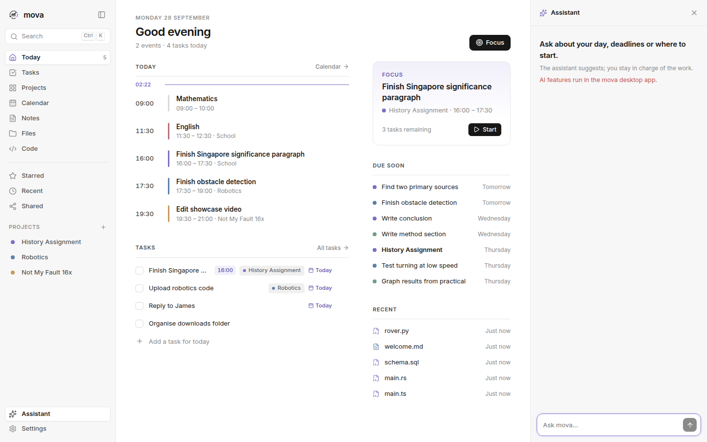 |
| **Dark theme** | **Code, dark** |
| 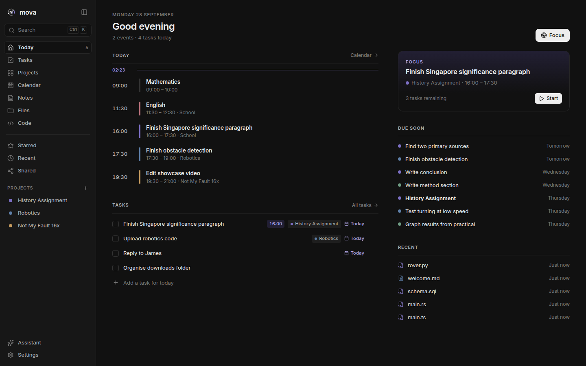 | 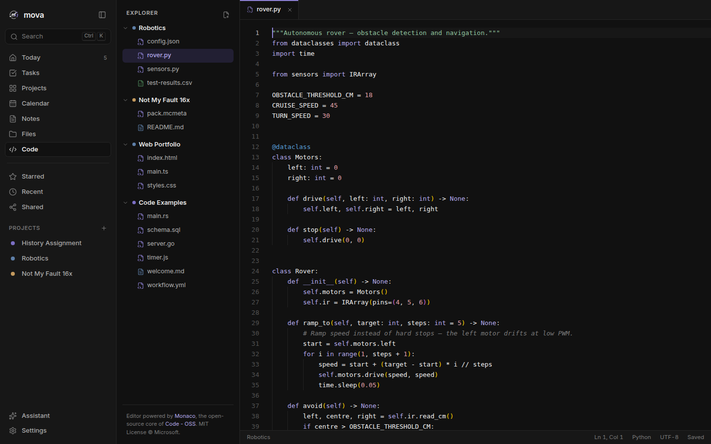 |

The screenshots are real. They are captured from the app by `npm run screenshots`.

## Features

| Area | What you get |
|---|---|
| **Today** | Timeline of events and scheduled tasks with a live "now" line, today's tasks, a suggested focus, what's due soon and recent items |
| **Projects** | Areas (School, Work, Personal…), progress, deadlines and stars. Each project has Overview, Tasks, Notes, Files, Calendar and Links tabs |
| **Tasks** | Today / Upcoming / All / No project / Completed views, quick add with project and due date, and a detail panel with scheduling |
| **Calendar** | Week timeline. Drag unscheduled tasks onto a time slot, drag blocks to move them, double-click to add an event |
| **Notes** | A simple writing surface. Select any line and press **Turn into task**; the task links back to the note |
| **Files** | Folder tree, Starred / Recent / Shared, drag-and-drop upload, file details, and project assignment |
| **Code** | A full code editor built on **Monaco**, the open-source core of **Code - OSS (VS Code)**. It has syntax highlighting for 80+ languages, tabs, auto-save, find/replace and multi-cursor editing |
| **Focus** | A full-screen timer (25/50/90 min) on one task; everything else disappears |
| **Search** | One box across projects, tasks, notes, files and events (`Ctrl/⌘ K`) |
| **Assistant** | An optional AI helper (`Ctrl/⌘ J`). See [docs/AI.md](docs/AI.md) |
| **Themes** | Light, dark and system |

Example files are included so you can try the editor straight away: Python, TypeScript, HTML, CSS, Rust, Go, SQL, JavaScript, YAML, JSON and Markdown.

## Quick start

```bash
npm install
npm run tauri dev     # run the desktop app
```

Prerequisites: Node 20+, Rust stable, and the [Tauri system dependencies](https://tauri.app/start/prerequisites/). See **[docs/DEVELOPMENT.md](docs/DEVELOPMENT.md)** for the full setup, builds and the release checklist.

## Documentation

- [User guide](docs/USER_GUIDE.md): every screen and shortcut
- [Architecture](docs/ARCHITECTURE.md): how the app is put together
- [AI](docs/AI.md): what the AI does, how keys are handled, limits
- [Development](docs/DEVELOPMENT.md): setup, scripts, building and releasing

## Credits

mova stands on the shoulders of open-source projects:

- **[Monaco Editor](https://github.com/microsoft/monaco-editor)**: the code editor that powers [Code - OSS / VS Code](https://github.com/microsoft/vscode). MIT License, © Microsoft Corporation.
- **[Tauri](https://tauri.app)**, **[React](https://react.dev)**, **[Zustand](https://github.com/pmndrs/zustand)**, **[Lucide](https://lucide.dev)** icons, and the **[Inter](https://rsms.me/inter)** typeface by Rasmus Andersson.

Full attributions are in [THIRD_PARTY_NOTICES.md](THIRD_PARTY_NOTICES.md).

## Legal

- [LICENSE](LICENSE): mova source code licence
- [TERMS.md](TERMS.md): Terms of Use
- [PRIVACY.md](PRIVACY.md): Privacy Notice
- [THIRD_PARTY_NOTICES.md](THIRD_PARTY_NOTICES.md): open-source licences

© 2026 Mova Inc. All rights reserved.
