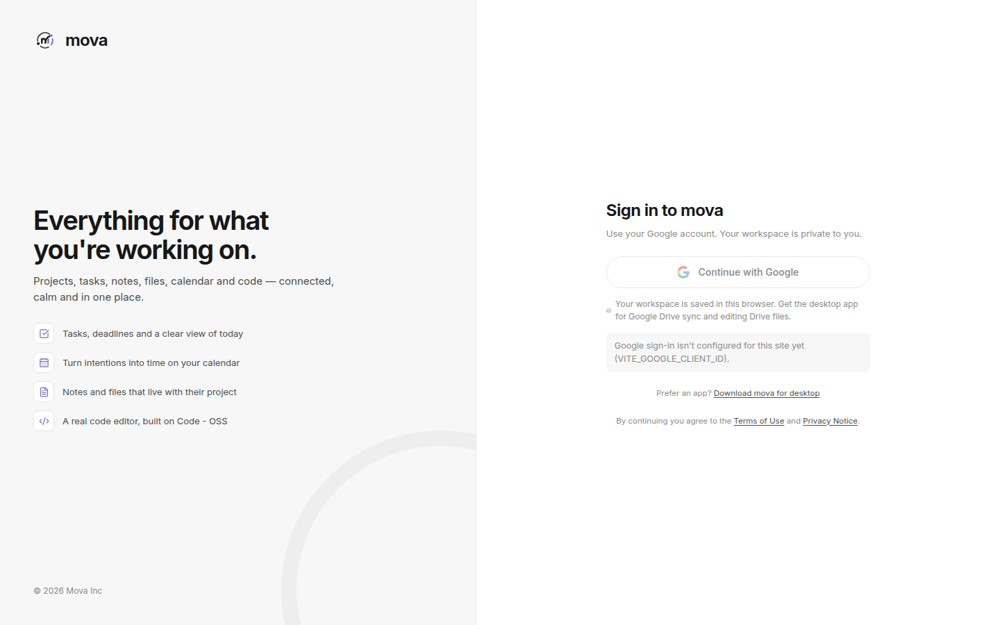
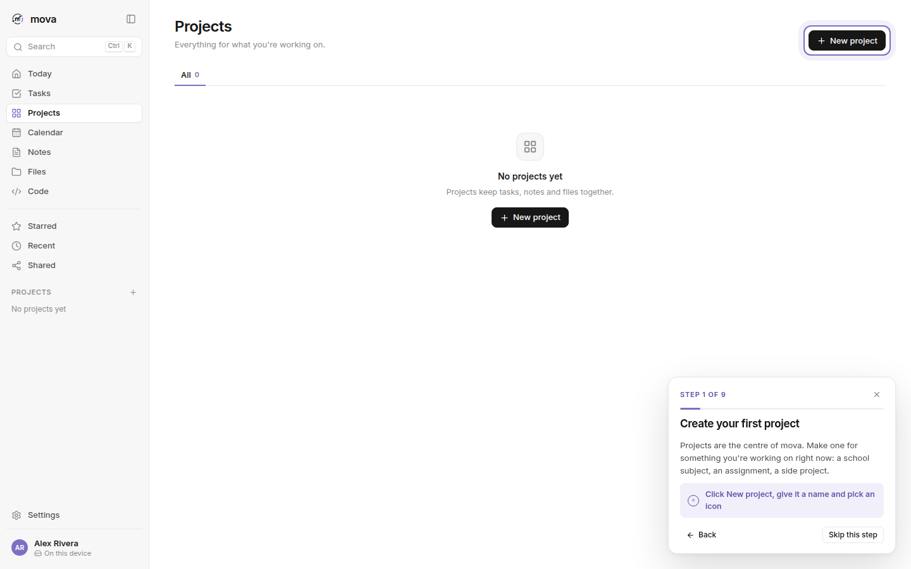
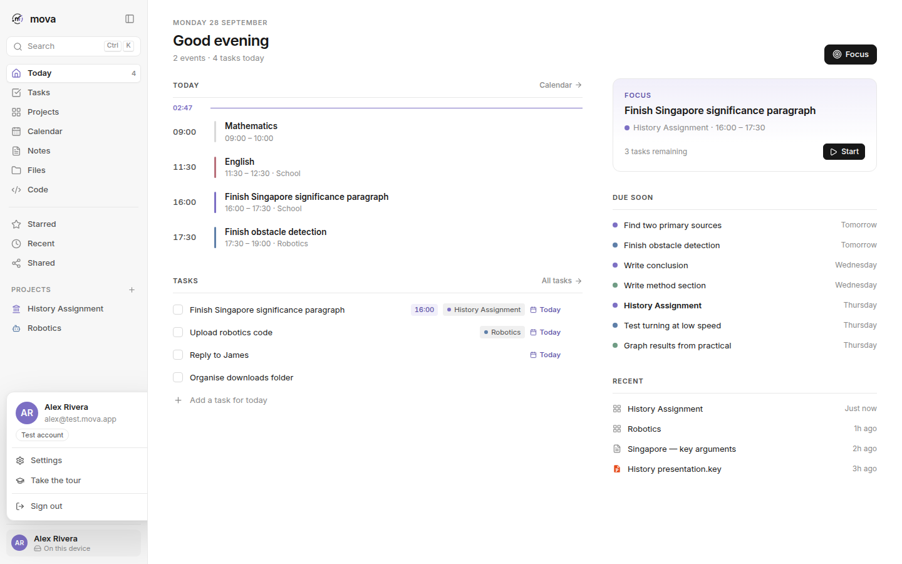

<p align="center">
  
</p>

<h1 align="center">mova</h1>
<p align="center"><strong>Everything for what you're working on.</strong></p>
<p align="center">A calm, project-based workspace for tasks, notes, files, calendar, code and focus.<br/>Desktop app (Tauri 2 + React + TypeScript), web app, website and docs, all in one repository.</p>

<p align="center">
  <a href="https://movadesktop.vercel.app">Website</a> ·
  <a href="https://movadesktopweb.vercel.app">Web app</a> ·
  <a href="https://movadocs.vercel.app">Docs</a> ·
  <a href="https://movadesktop.vercel.app/download">Download</a>
</p>

---


## Why mova

Your work shouldn't be scattered across ten apps. mova is organised around **projects**. Open one and its tasks, notes, files, deadlines, links and code are all there, and the **Today** screen answers one question: *what am I actually doing today?*

- **Project-first.** Everything belongs somewhere, and everything is searchable everywhere.
- **Dense when you need information, empty when you need focus.**
- **No productivity theatre.** There are few settings and few decisions, so you spend less time managing and more time doing.
- **AI that stays small.** It suggests next steps and never does the work for you.

## Screenshots

| Sign in with Google | A hands-on tour for new accounts |
|---|---|
|  |  |
| **Projects**, with icons | **Project workspace** |
|  |  |
| **Tasks** | **Calendar**: drag tasks onto time |
|  |  |
| **Notes**: turn lines into tasks | **Files**, with real file-type icons |
|  |  |
| **Code**: Monaco / Code - OSS editor | **Search**: `Ctrl/⌘ K` |
|  |  |
| **Focus mode** | **Account menu** |
|  |  |
| **Dark theme** (follows your device) | **Code, dark** |
|  |  |

The screenshots are real. `npm run screenshots` captures them from the app using a test account and the demo data in `scripts/demo/`; the app itself starts empty.

## Features

| Area | What you get |
|---|---|
| **Accounts** | Sign in with Google (required). Each account has its own private workspace |
| **Storage** | Desktop: this device, optionally synced to a private app folder in your Google Drive. Web: this browser |
| **Tour** | New accounts start empty and are walked through every feature by actually using it |
| **Today** | Timeline of events and scheduled tasks with a live "now" line, today's tasks, a suggested focus, what's due soon and recent items |
| **Projects** | Areas, colours, pickable icons, progress and deadlines. Overview, Tasks, Notes, Files, Calendar and Links tabs |
| **Tasks** | Today / Upcoming / All / No project / Completed, quick add, and a detail panel with scheduling |
| **Calendar** | Week timeline. Drag tasks onto time slots, move blocks, double-click to add an event |
| **Notes** | Simple writing. Select any line and press **Turn into task**; the task links back to its note |
| **Files** | Folders, Starred / Recent / Shared, drag-and-drop upload, and real file-type icons (Material Icon Theme) |
| **Google Drive** | Desktop: browse your Drive and open, edit and save files in place from the code editor |
| **Code** | A full editor built on **Monaco**, the open-source core of **Code - OSS (VS Code)**, with 80+ languages |
| **Focus** | A full-screen timer (25/50/90 min) on one task |
| **Search** | One box across projects, tasks, notes, files and events (`Ctrl/⌘ K`) |
| **AI** | Desktop: an optional assistant (`Ctrl/⌘ J`) and suggestion-only helpers |
| **Themes** | System (default), light and dark |

## What's in this repository

| Folder | What | Deployed to |
|---|---|---|
| `src/` + `src-tauri/` | **Desktop app**: the React UI and the native Rust layer (sign-in, Drive, AI) | Installers on GitHub Releases, via `.github/workflows/release.yml` |
| `web/` | **Web app**: builds the same `src/` for the browser | [movadesktopweb.vercel.app](https://movadesktopweb.vercel.app) |
| `website/` | **Website**: Home, Features, Download, Changelog, About, Terms, Privacy, Licences | [movadesktop.vercel.app](https://movadesktop.vercel.app) |
| `docs/` | **Docs**: Markdown, plus a docs site styled like the app | [movadocs.vercel.app](https://movadocs.vercel.app) |

## Quick start

```bash
npm install
cp .env.example .env.local   # fill in your Google / OpenAI values (all optional for a first run)
npm run tauri dev            # desktop app
npm run dev:web              # web app at http://localhost:1420
```

Prerequisites: Node 20+ (22+ for the screenshot script), Rust stable, and the [Tauri system dependencies](https://tauri.app/start/prerequisites/).

## Configuration

Every variable is listed, with example values, in the `.env.example` files:

| File | For |
|---|---|
| [`.env.example`](.env.example) | Local development: `MOVA_GOOGLE_CLIENT_ID`, `MOVA_GOOGLE_CLIENT_SECRET`, `MOVA_OPENAI_API_KEY`, `VITE_GOOGLE_CLIENT_ID` |
| [`web/.env.example`](web/.env.example) | The web app's Vercel project |
| [`website/.env.example`](website/.env.example) | The website's Vercel project |
| [`docs/.env.example`](docs/.env.example) | The docs' Vercel project |

To set up the Google Cloud project and its two OAuth clients (Web and Desktop), see **[docs/AUTH.md](docs/AUTH.md)**. Deployment is covered in **[docs/DEVELOPMENT.md](docs/DEVELOPMENT.md#deploying-the-sites)**.

## Releases

Push a version tag and GitHub Actions builds mova for **macOS (Apple Silicon)**, **Windows** and **Linux** and publishes a GitHub Release. The website's Download page picks it up automatically.

```bash
git tag v0.1.0 && git push origin v0.1.0
```

See [docs/RELEASES.md](docs/RELEASES.md).

## Documentation

[movadocs.vercel.app](https://movadocs.vercel.app), or in this repository:
[Introduction](docs/INTRODUCTION.md) · [Getting started](docs/GETTING_STARTED.md) · [User guide](docs/USER_GUIDE.md) · [Google sign-in](docs/AUTH.md) · [Sync & Google Drive](docs/DRIVE.md) · [AI](docs/AI.md) · [Web app](docs/WEB.md) · [Downloads & releases](docs/RELEASES.md) · [Architecture](docs/ARCHITECTURE.md) · [Development](docs/DEVELOPMENT.md)

## Credits

mova stands on the shoulders of open-source projects:

- **[Monaco Editor](https://github.com/microsoft/monaco-editor)**: the code editor that powers [Code - OSS / VS Code](https://github.com/microsoft/vscode). MIT License, © Microsoft Corporation.
- **[Material Icon Theme](https://github.com/material-extensions/vscode-material-icon-theme)**: file-type icons. MIT License, © Material Extensions.
- **[Tauri](https://tauri.app)**, **[React](https://react.dev)**, **[Zustand](https://github.com/pmndrs/zustand)**, **[Lucide](https://lucide.dev)** icons, **[marked](https://github.com/markedjs/marked)**, and the **[Inter](https://rsms.me/inter)** typeface by Rasmus Andersson.

Full attributions are in [THIRD_PARTY_NOTICES.md](THIRD_PARTY_NOTICES.md).

## Legal

[LICENSE](LICENSE) · [Terms of Use](TERMS.md) · [Privacy Notice](PRIVACY.md) · [Third-party notices](THIRD_PARTY_NOTICES.md)

© 2026 Mova Inc. All rights reserved.
